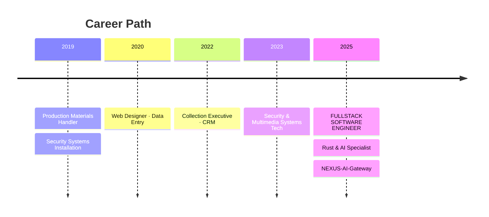

<!-- ========================================= -->
<!--  enerBydev — Enterprise GitHub Profile README  -->
<!--  Crafted with precision. Inspired by the best. -->
<!-- ========================================= -->

<!-- Animated Header Banner -->
<div align="center">
  
</div>

<!-- Animated Typing Introduction -->
<div align="center">
  <a href="https://git.io/typing-svg">
    
  </a>
</div>

<!-- Social & Contact Badges -->
<div align="center">
  <a href="https://enerbydev.pages.dev" target="_blank">
    
  </a>
  <a href="https://linkedin.com/in/enerbydev" target="_blank">
    
  </a>
  <a href="mailto:rjmendoza.s@gmail.com" target="_blank">
    
  </a>
  <a href="https://wa.me/528675712611" target="_blank">
    
  </a>
  <a href="https://github.com/enerBydev?tab=repositories" target="_blank">
    
  </a>
</div>

<br />

<!-- Location & Availability Badge -->
<div align="center">
  
  
  
  
</div>

<br />

---

<!-- About Me Section - Code Styled -->
###  About Me

```rust
// enerby-core/src/profile.rs
#[derive(Debug, Clone)]
pub struct Developer {
    pub name: &'static str,
    pub handle: &'static str,
    pub location: &'static str,
    pub role: &'static str,
    pub specialization: Vec<&'static str>,
    pub languages: Vec<&'static str>,
    pub current_focus: &'static str,
    pub philosophy: &'static str,
}

impl Default for Developer {
    fn default() -> Self {
        Self {
            name: "Rene de Jesus Mendoza Saucedo",
            handle: "enerBydev",
            location: "Nuevo Laredo, Tamaulipas, Mexico",
            role: "Fullstack Software Engineer",
            specialization: vec![
                "High-Performance Rust Systems",
                "AI/LLM Proxy Architectures",
                "Distributed Backend Services",
                "Full-Stack Web Development",
                "UI/UX & Digital Design",
            ],
            languages: vec!["Spanish (Native)", "English (Technical Advanced)"],
            current_focus: "Building NEXUS-AI-Gateway ecosystem",
            philosophy: "Zero-cost abstractions. Maximum performance. Clean architecture.",
        }
    }
}

impl Developer {
    pub fn introduce(&self) {
        println!(
            "Hey, I'm {} (@{}). I build systems that don't break under pressure.",
            self.name, self.handle
        );
        println!(
            "Currently specializing in Rust + AI infrastructure — \
             from low-level proxy servers to full-stack applications."
        );
        println!("Open to collaborate on ambitious projects.");
    }
}
```

<br />

---

<!-- Tech Stack Section -->
###  Tech Arsenal

#### Core Stack — Systems & Backend
<p align="left">
  
  
  
  
  
  
  
</p>

#### Rust Ecosystem
<p align="left">
  
  
  
  
  
</p>

#### AI / LLM Integration
<p align="left">
  
  
  
  
  
</p>

#### Frontend & Design
<p align="left">
  
  
  
  
  
  
  
  
</p>

#### DevOps & Infrastructure
<p align="left">
  
  
  
  
  
  
  
</p>

#### Multimedia & Design Tools
<p align="left">
  
  
  
  
</p>

<br />

---

<!-- Featured Projects Section -->
###  Featured Projects

<!-- Project 1: NEXUS-AI-Gateway -->
<div align="center">
  <table>
    <tr>
      <td width="50%" valign="top">
        <h4 align="center">
          <a href="https://github.com/enerBydev/nexus-ai-gateway" target="_blank">
            
          </a>
        </h4>
        <p align="center">
          
          
          
          
        </p>
        <p>High-performance proxy server in <strong>Rust</strong> that intercepts and routes LLM API traffic (Claude, OpenAI) to alternative backends (<strong>NVIDIA NIM</strong>, <strong>Ollama</strong>). Features request transformation, intelligent retry logic, advanced concurrency with semaphores, SSE streaming, and circuit breaker patterns.</p>
        <p align="center">
          <a href="https://github.com/enerBydev/nexus-ai-gateway" target="_blank">
            
          </a>
        </p>
      </td>
      <td width="50%" valign="top">
        <h4 align="center">
          <a href="https://github.com/enerBydev/nexus-beacon-receiver" target="_blank">
            
          </a>
        </h4>
        <p align="center">
          
          
          
          
        </p>
        <p>Microservice that receives daily telemetry beacons from <strong>NEXUS AI Gateway</strong> instances, stores them in a <strong>D1 database</strong>, and provides global statistics on usage patterns. Built for observability at scale.</p>
        <p align="center">
          <a href="https://github.com/enerBydev/nexus-beacon-receiver" target="_blank">
            
          </a>
        </p>
      </td>
    </tr>
    <tr>
      <td width="50%" valign="top">
        <h4 align="center">
          <a href="https://github.com/enerBydev/enerby-dev" target="_blank">
            
          </a>
        </h4>
        <p align="center">
          
          
          
        </p>
        <p>Personal developer portfolio showcasing projects, professional history, completed and in-development works, and objectives. Built with modern frontend stack.</p>
        <p align="center">
          <a href="https://enerbydev.pages.dev" target="_blank">
            
          </a>
          <a href="https://github.com/enerBydev/enerby-dev" target="_blank">
            
          </a>
        </p>
      </td>
      <td width="50%" valign="top">
        <h4 align="center">
          
        </h4>
        <p align="center">
          
          
          
        </p>
        <p align="center"><em>Building something extraordinary.<br/>Stay tuned.</em></p>
      </td>
    </tr>
  </table>
</div>

<br />

---

<!-- Architecture & Patterns Section -->
###  Architecture & Design Patterns

```
┌─────────────────────────────────────────────────────────────────┐
│                      SYSTEMS ARCHITECTURE                        │
├─────────────────────────────────────────────────────────────────┤
│                                                                  │
│  ┌──────────────┐    ┌──────────────┐    ┌──────────────┐       │
│  │   LLM APIs   │───▶│ NEXUS-AI-    │───▶│   Backends   │       │
│  │Claude/OpenAI │    │   Gateway    │    │NVIDIA/OLLAMA │       │
│  └──────────────┘    └──────┬───────┘    └──────────────┘       │
│                             │                                    │
│                    ┌────────▼────────┐                           │
│                    │  Circuit Breaker │                           │
│                    │  Retry Logic    │                           │
│                    │  SSE Streaming   │                           │
│                    └────────┬────────┘                           │
│                             │                                    │
│                    ┌────────▼────────┐                           │
│                    │ Beacon Receiver │                           │
│                    │   Telemetry     │                           │
│                    │     D1 DB       │                           │
│                    └─────────────────┘                           │
│                                                                  │
├─────────────────────────────────────────────────────────────────┤
│  PATTERNS: Proxy ◆ Circuit Breaker ◆ SSE ◆ Microservices       │
│            ◆ Async/Await ◆ Concurrency ◆ Fault Tolerance        │
└─────────────────────────────────────────────────────────────────┘
```

<br />

---

<!-- GitHub Stats Section -->
###  GitHub Analytics

<div align="center">
  <!-- GitHub Stats Card -->
  
  <!-- Top Languages Card -->
  
</div>

<br />

<div align="center">
  <!-- Streak Stats -->
  
</div>

<br />

<div align="center">
  <!-- Trophy Stats -->
  
</div>

<br />

<div align="center">
  <!-- Activity Graph -->
  
</div>

<br />

---

<!-- Professional Experience Timeline -->
###  Professional Journey



<br />

---

<!-- Soft Skills Section -->
###  Competencies

<div align="center">
  <table>
    <tr>
      <td align="center">
        <br/>
        <sub>Rapid context switching across tech stacks</sub>
      </td>
      <td align="center">
        <br/>
        <sub>From code to field diagnostics</sub>
      </td>
      <td align="center">
        <br/>
        <sub>Shipping what matters</sub>
      </td>
    </tr>
    <tr>
      <td align="center">
        <br/>
        <sub>Technical translation for stakeholders</sub>
      </td>
      <td align="center">
        <br/>
        <sub>Prioritization under pressure</sub>
      </td>
      <td align="center">
        <br/>
        <sub>From fieldwork to boardroom</sub>
      </td>
    </tr>
  </table>
</div>

<br />

---

<!-- What I Bring Section -->
###  What I Bring to Your Team

| Dimension | Value |
|-----------|-------|
| **Systems Engineering** | Production-grade Rust applications with Tokio async runtime, memory-safe concurrency, and zero-cost abstractions |
| **AI Infrastructure** | Deep expertise in LLM API integration, proxy architectures, request transformation, and multi-backend routing |
| **Full-Stack Delivery** | End-to-end ownership from backend services to polished frontend interfaces |
| **Design Thinking** | Professional-grade UI/UX, branding, and multimedia production capabilities |
| **Operational Resilience** | Circuit breakers, retry logic, SSE streaming, fault-tolerant distributed patterns |
| **Cross-Domain Agility** | Unique blend of software engineering, technical systems, and business operations experience |

<br />

---

<!-- Currently Section -->
###  Currently

- 🔨 **Building:** [NEXUS-AI-Gateway](https://github.com/enerBydev/nexus-ai-gateway) — Enterprise-grade LLM proxy infrastructure
- 🦀 **Deepening:** Advanced Rust patterns — zero-copy parsing, lock-free data structures
- 🤖 **Exploring:** Multi-modal AI agents and autonomous system orchestration
- 🌐 **Open to:** Remote/hybrid opportunities — Fullstack · Backend · AI Infrastructure roles
- 📍 **Based in:** Nuevo Laredo, Mexico · Willing to relocate

<br />

---

<!-- Contact Section -->
###  Let's Build Something

<div align="center">
  <p><em>"Great software is built by people who care about the craft."</em></p>

  <a href="mailto:rjmendoza.s@gmail.com" target="_blank">
    
  </a>
  <a href="https://linkedin.com/in/enerbydev" target="_blank">
    
  </a>
  <a href="https://wa.me/528675712611" target="_blank">
    
  </a>
</div>

<br />

<!-- Tech Stack Summary Badges -->
<div align="center">
  
  
  
</div>

<br />

<!-- Animated Footer -->
<div align="center">
  
</div>

<!-- Signature -->
<div align="center">
  <sub>Built with precision by <strong>enerBydev</strong> · <em>Fearless concurrency. Zero compromises.</em></sub>
</div>
